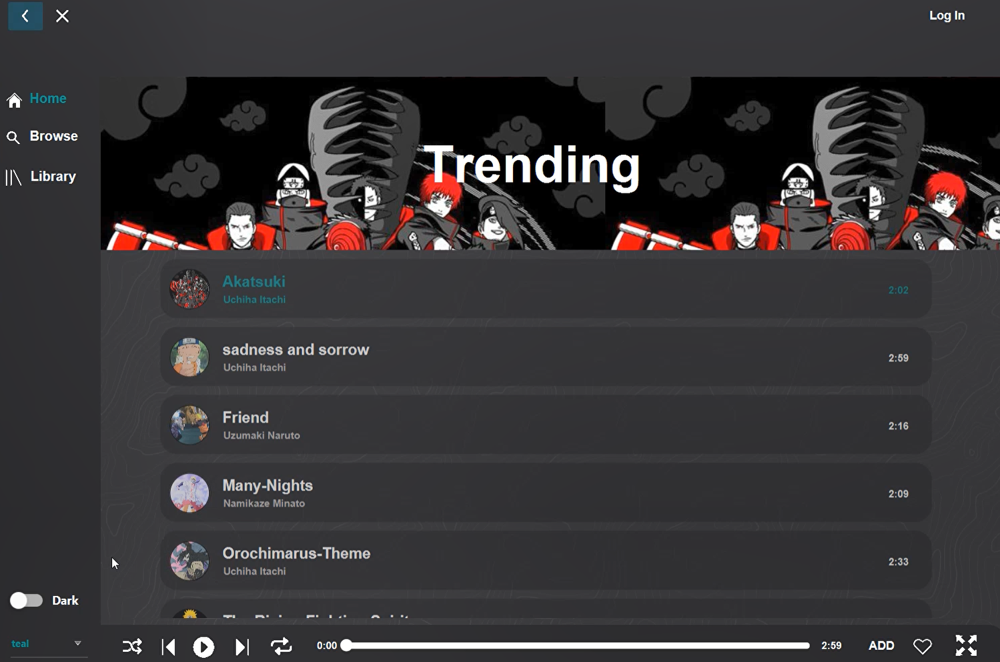
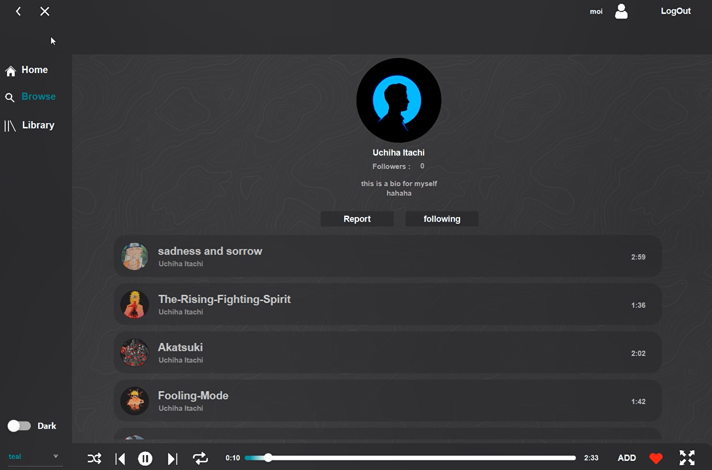
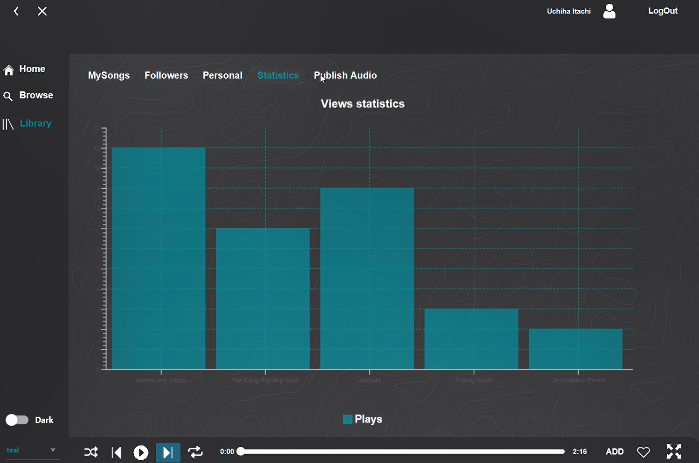

# Music Player App

This is a Music Player app, developed for my advanced programming course using Java, is designed as a feature-rich Spotify clone. It allows users to play, pause, shuffle, and loop songs, providing a seamless music streaming experience. Artists can manage their songs, while users can search and browse for tracks with ease. The app includes a trending page for popular music, personalized suggestions, and detailed statistics about listening habits. With support for custom playlists and multiple themes, this app offers a dynamic and customizable user experience for music lovers.

You can watch the demo video on [YouTube]()

### Home Page

### Artist Page

### Artist Library Page

## Features 
- Play, Pause, Shuffle, Loop
- Artists can manage songs
- Search and Browse 
- Multiple Themes
- Trending Page
- Suggestions
- Statistics
- Playlists

## Usage
Click on login and use this example artist to view the app as an artist
- Username: `Uchiha Itachi`
- Password: `singerOne#1`

## Credits
By Maryam Dar

May 2024

